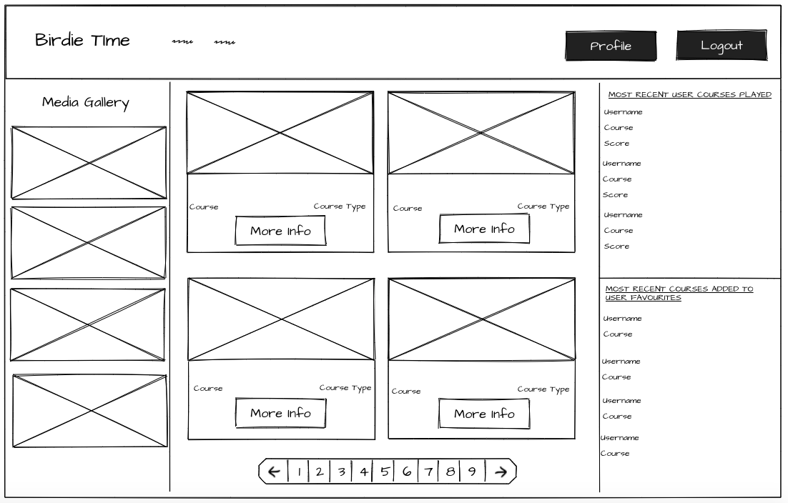
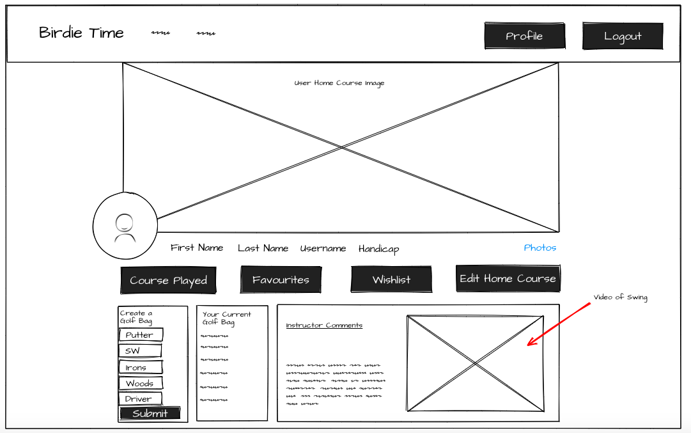
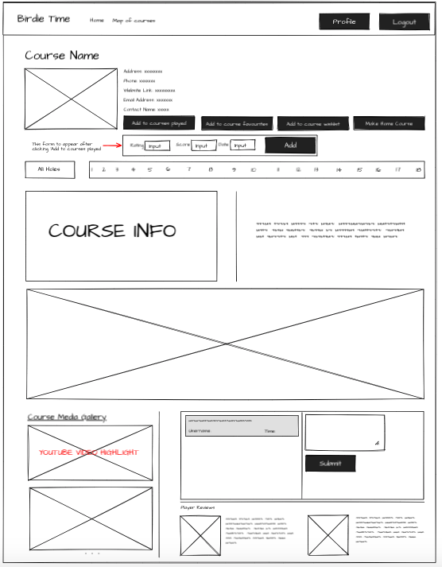
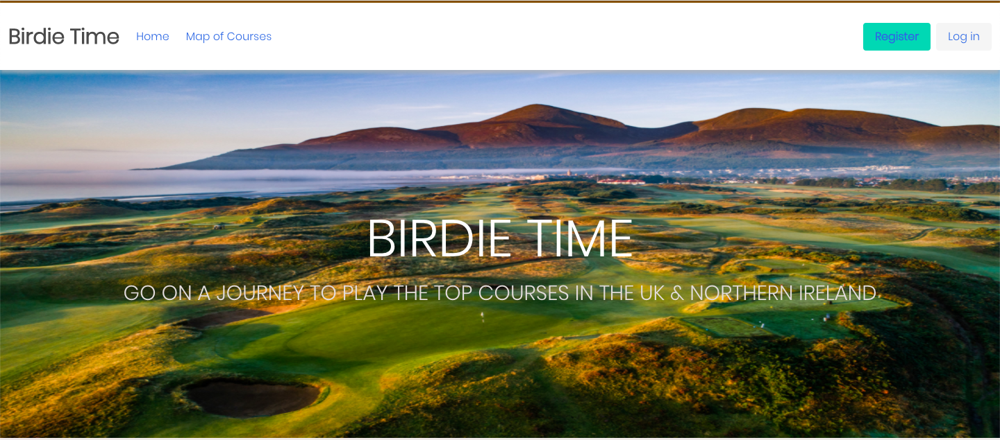

###  General Assembly, Software Engineering Immersive

# Birdie Time

## Overview

Birdie Time was the fourth and final project that I completed during the Software Engineering Course. It is a full-stack desktop web application with a React.js front-end, a Django-Python back-end, and a PostgreSQL database.

This was a week long project and we had the option as a cohort to do it in groups or individually. I decided to do the project solo for a couple of reasons. I was eager to produce an application on a topic that I was very passionate about and secondly I was very keen to really understand where my skill level had got to over the three month course in order that when the course had finished I knew what areas I need to work on and improve. Lastly I didn't do a huge amount of work on the backend for my third project and I was keen to work and understand databases. 

Birdie Time is looking to take golf lovers on a journey to playing the top 50 golf courses in the UK & Northern Ireland. The inspiration to make a golf based app is because of my own love for the game and also due to the fact that the world of golf is definitely evolving with the current times and is probably the latest sport to be making moves and evolving through technological advancements.  

Birdie Time is going to be a 3 stage process and during the week long time-frame I completed the first stage. The first concept is to provide the user with a great amount of detail and all the relevant information on the top 50 courses as well as allowing the user to interact with each course. The second stage is for users to be able to follow each other, match based on handicap levels and compare scores, match based on the location of their local course and join virtual golf clubs where they can discuss courses and arrange times to play with each other. Lastly is for users to have their golf swing analysed and commented on by an online instructor.


Check out [Birdie Time](https://birdie-time.herokuapp.com/)

## Table of contents
1. [Brief](#Brief)
2. [Technologies used](#Technologies-used)
3. [Approach](#Approach)
    - [Planning](#Planning)
    - [Wireframes]
    - [Back-end](#Back-end)
    - [Front-end](#Front-end)
    - [File Structure](#File-structure)
4. [Screenshots](#Screenshots)
5. [Potential future features](#Potential-future-features)
6. [Bugs](#Bugs)
7. [Lessons learned](#Lessons-learned)
8. [Credit](#credit)

## Brief

* Choose to work solo or in a team
* **Build a full-stack application** by making your own backend and your own front-end
* **Use a Python Django API** using Django REST Framework to serve your data from a Postgres database
* **Consume your API with a separate front-end** built with React
* **Be a complete product** which most likely means multiple relationships and CRUD functionality for at least a couple of models
* **Implement thoughtful user stories/wireframes** that are significant enough to help you know which features are core MVP and which you can cut
* **Have a visually impressive design** to kick your portfolio up a notch and have something to wow future clients & employers. 
* **Be deployed online** so it's publicly accessible.


## Technologies Used
| Category | List |
| ---- | --- |
| Languages                            | Javascript (ECMAScript6), CSS3, Sass, HTML5 |
| Front-end Web Application Framework  | React.js |
| Server Environment                   | Django-Python |
| Database                             | PostgreSQL |
| CSS Framework                        | Bulma |
| REST client                          | Insomnia, Django Rest Framework |
| Typefaces                            | Font Awesome |
| Text Editor                          | VS Code |
| Browser                              | Chrome |
| Version control | Git and GitHub

## Approach Taken

### The Plan

At the start of the project I knew that I felt more comfortable with the front-end instead of the back-end and therefore gave myself more time to get the back-end right. Originally I tried to find an external API that would help generate all my data, however, there were no free public API's and therefore I decided to create the API myself and generate all the data using the django admin panel. 

I knew this approach would be relatively inefficient but it was the only way for me to generate all the data I needed in order that I could fetch it on the front-end. Due to the level of detail I wanted to provide for each course, to ensure the best possible user experience I knew that I would be creating many tables in the database and had to ensure that all the relationships between the models were accurate. 

### Wireframes

Several wireframes were put together on a site called MockFlow.

#### User Home

<p align="center">
  
</p>

#### User Profile
<p align="center">
  
</p>


#### Profile Page
<p align="center">
  
</p>


### The Back-end

As I have mentioned above there were going to be many relationships to work out and tables within the database.

#### Models

For the PostgreSQL database there are many tables for an individual golf course and the user. Currently a couple of the tables are not ineffect right now as they will be used when I work on the other two concepts for this application. 

Due to my knowledge of golf I understood the relationships between all the features on the golf course and felt comfortable translating this knowledge within my models for the golf course. It was vital that I got the models for the golf course right at the beginning as many complications and loss of precious time could have come from me having to drop the database due to errors I made in my models. Having said this on the application at the moment there are only 5 courses being shown and not 50. The reason for this is that I have realised I need to make adjustments to my models both for the golf course and for the user in the future to be able to instill the other concepts to the application. However, even though in my planning I should potentially have thought further ahead before writing the models but I was concentrating on what I need to generate for my MVP. 

Below are a few of the golf course models:

```py
class Course(models.Model):
  name = models.CharField(max_length=50)
  number_of_holes = models.IntegerField()
  country = models.CharField(max_length=20)
  phone_number = models.CharField(max_length=20, blank=True)
  website_link = models.URLField(max_length=400)
  contact_name = models.CharField(max_length=20)
  year_built = models.PositiveIntegerField(blank=True)
  email_address = models.EmailField()
  green_fees = models.CharField(max_length=5, blank=True)
  ranking = models.PositiveIntegerField()
  hero_image = models.CharField(max_length=300)
  description = models.CharField(max_length=500)
  video_highlight_link = models.CharField(max_length=400)
  video_description = models.CharField(max_length=200, blank=True)
  pro_golfer_img_1 = models.CharField(max_length=300)
  pro_golfer_img_2 = models.CharField(max_length=300)
  pro_golfer_1_review = models.CharField(max_length=200)
  pro_golfer_2_review = models.CharField(max_length=200)
  course_type = models.CharField(max_length=10)
  scorecard = models.CharField(max_length=300)

  address = models.OneToOneField(Address, on_delete=models.PROTECT)

  def __str__(self):
    return self.name
```

As you can see directly from the model above that I am implementing a lot of data into this project and I was aware that this was going to take time but I was eager to make sure the user was getting all the relevant information they needed about the course in order to kick start the process of them wanting to play it. 

```py
class Hole(models.Model):
  number = models.PositiveIntegerField()
  video = models.CharField(max_length=400, blank=True)
  hole_graph = models.CharField(max_length=400, blank=True)
  bunkers = models.PositiveIntegerField()
  Mens_Par = models.PositiveIntegerField()
  Mens_SI = models.PositiveIntegerField()
  Ladies_Par = models.PositiveIntegerField()
  Ladies_SI = models.PositiveIntegerField()

  course = models.ForeignKey(Course, related_name='coursesholes', on_delete=models.PROTECT)

  def __str__(self):
    return f'{self.course} - {self.number}'
```

```py 
class HoleTeeBox(models.Model):
  teeboxtype = models.CharField(max_length=30)
  color = models.CharField(max_length=10)
  length = models.PositiveIntegerField()

  hole = models.ForeignKey(Hole, related_name="holes", on_delete=models.CASCADE)

  def __str__(self):
    return f'{self.hole} - {self.color}'
```

I really wanted the user to be able to explore each course to its full potential which is why I decided to manually add in the django admin panel all 18 holes to the golf course and all the teeboxes for each hole. However, I knew there would be some variety between the courses with regards to the number of teeboxes on a hole and therefore only implemented three for each course as I knew this would be easier to manage on the front-end. 

The ForeignKey relationship was critical here as I understood a course needs many holes and a hole needs many teeboxes. However, frustratingly I had realised when nesting my serializers and understanding to do this I could use the `related_name` that I used a name that is confusing for the `HoleTeeBox` model by making the `related_name="holes"`. 

Below are the user models:

```py
class User(AbstractUser):

  first_name = models.CharField(max_length=20, blank=True)
  last_name = models.CharField(max_length=20, blank=True)
  user_bio = models.CharField(max_length=200, blank=True)
  handicap = models.PositiveIntegerField(null=True)
  profileimage = models.ImageField(blank=True)
  video_of_swing = models.FileField(blank=True)

```

For the users, I extended the basic User provided by Django to include the following extra fields: first_name, last_name, user_bio, handicap, profileimage and video_of_swing. Originally the purpose of this model was for users once they have registered and logged in that they could then update their profile information by adding this information. However, I struggled to implement a PUT route due to not quite writing the correct code in my Views and therefore at the moment this model is a little redundant. Furthermore, as a consequence I couldn't quite follow the wireframe I had drawn up for the user profile and therefore had to adapt. 


```py
class GolfBag(models.Model):
  putter = models.CharField(max_length=30)
  sw = models.CharField(max_length=30)
  pw = models.CharField(max_length=30)
  gw = models.CharField(max_length=30)
  lw = models.CharField(max_length=30)
  ulw = models.CharField(max_length=30)
  irons = models.CharField(max_length=30)
  woods = models.CharField(max_length=30)
  driver = models.CharField(max_length=30)

  user = models.ForeignKey(User, related_name="usergolfbag", on_delete=models.PROTECT)

  def __str__(self):
    return f'{self.user}'
```

The ability for a user to create a golf bag was an important feature for the MVP and the UX. I have, however, made a slight error with my relationship between the user and it's golfbag. This should be a `One-to-One` relationship instead of a ForeignKey relationship. I was only intending for the user to create one golf bag which they would be able to edit on their profile. Currently they are able to post many golf bags to the database but to counter this issue on the front-end the GET request for the users golfbag brings back a response of the most recent golfbag that has been created by the user. 

```js
 const golfbag = this.state.user.usergolfbag[0]
```

There are three other important models that definitely added to the UX of the application at this current point in time.

```py

class UserHomeCourse(models.Model):
  course = models.OneToOneField(Course, on_delete=models.PROTECT)
  user = models.ForeignKey(User, related_name="userhomecourse", on_delete=models.PROTECT)

  def __str__(self):
    return f'{self.user} + {self.course}' 
```

The user adding a home course is vital for the future concepts of the project. However, this model definitely needs to be adjusted in the future as the relationships are not quite correct. I would like for users to be able to find each other based on their home course and so that they can play with each other. 


```py
class UserCoursePlayed(models.Model):

  rating = models.PositiveIntegerField()
  score = models.PositiveIntegerField()
  time = models.DateField()
  course = models.ManyToManyField(Course, related_name="courseplayed", blank=True)

  user = models.ForeignKey(User, related_name="usercourseplayed", on_delete=models.CASCADE)

  def __str__(self):
    return f'{self.user} + {self.course}' 
```

I wanted the user to be add a course played that they had played with a little bit more information. I was originally going to try add validation to stop the user from adding the course twice on the front-end for the same day but then thought there maybe occurances that the golfer does play twice on the same day.

In the serializers I changed the specifications for the DateField. This was to make it simpler on the front-end for the user to input. However, in the future I would like to have a proper calendar shown to the user to select the date.

```py
time = fields.DateField(input_formats=['%Y-%m-%d'])
```

```py
class CourseComment(models.Model):
  comment = models.CharField(max_length=200)
  created_at = models.DateTimeField(auto_now_add=True)
  course = models.ForeignKey(Course, related_name="coursecomments", on_delete=models.PROTECT)
  user = models.ForeignKey(User, related_name='usercoursecomments', on_delete=models.PROTECT)

  def __str__(self):
    return f'{self.user} + {self.course}' 
```

I thought it was very important to add a comment feature. Currently the comments are only featured for the course but in the future I would like to add a comment section for each hole as well. I was having some difficulties being able to get the user data to appear in Insomnia and thus in turn on the front-end. So currently each comment doesn't have a designated user which is something I definitely intend to fix.

#### Serializers

The significant part of the serializers was to be able to nest them in a way that I would be able to use all the data on the front-end. 

- For the golf course serializers I had to create a populated course serializer which had all the fields of the course and then add the `related_names` to the end in order to nest the other serializers and for the data of those serializers to appear in Insomnia or the Django Rest Framework

```py
class PopulateCourseSerializer(serializers.ModelSerializer):

  address = AddressSerializer()
  coursesholes = HoleSerializer(many=True)
  coursesimages = CourseImageSerializer(many=True)
  coursecomments = PopulateCourseCommentSerializer(many=True)

  class Meta:

    model = Course
    fields = ('id', 'name', 'number_of_holes', 'country', 'phone_number',
    'website_link', 'contact_name', 'year_built', 'email_address', 'green_fees', 'ranking', 
    'hero_image', 'description', 'video_highlight_link', 'video_description', 'pro_golfer_img_1', 
    'pro_golfer_img_2', 'pro_golfer_1_review', 'pro_golfer_2_review', 'course_type', 'scorecard', 'address', 'coursesholes', 'coursesimages', 'coursecomments')
```

To add the course comments I had to import the `CourseComment` model from the `jwt_auth.models` and then create a serializer for the comments which was the nested in the `PopulateCourseSerializer`.

- For the user serializers I had to replicate what I had done with the course serializers but with one slight difference. To be able to read some of the data I had to create another serializer with the previous serializer as the argument within the parentheses. 

```py
class UserCoursePlayedSerializer(serializers.ModelSerializer):

    # course = CourseSerializer(read_only=True)
    # user = UserSerializer()
    time = fields.DateField(input_formats=['%Y-%m-%d'])

    class Meta:
      model = UserCoursePlayed
      fields = ('id', 'rating', 'score', 'time', 'course', 'user')

class UserCoursePlayedReadSerializer(UserCoursePlayedSerializer):
    course = CourseSerializer(many=True)
    user = UserSerializer(read_only=True)
```

From here I nested the `UserCoursePlayedReadSerializer` within in the `PopulatedUserSerializer`

#### Views

- User 
  - Frustratingly I had issues implementing end points for the user outside of the typical GET and POST requests as I was very eager for the user to be able to update and delete parts of their profile with the extra fields implemented in the user model but this unfortunately was a challenge that I couldn't solve within the project time.

  |           	| GET 	| POST 	| PUT 	| DELETE 	|
  |-----------	|-----	|------	|-----	|--------	|
  | /register 	|     	|   x  	|     	|        	|
  | /login    	|     	|   x  	|     	|        	|
  | /profile 	  |  x  	|    	  |  	    |     	  |
  | /profile/golfbag   	|   	|   x	  |   	  |       |
  | /profile/golfbag/<int:pk5>   	|  x 	|   	  |   	  |       |
  | /allcoursesplayed   |   x 	 |   	   |   	   |       |
  | /allcoursefavourites   |   x 	 |   	   |   	   |       |
  | /profile/coursesplayed   |    	 |   	x    |   	   |       |
  | /profile/courseswishlist   |    	 |   	x    |   	   |       |
  | /profile/coursesfavourites  |    	 |   	x    |   	   |       |
  | /profile/userhomecourse  |    	 |   	x    |   	   |       |

Due to how I had nested the serializers I was able to post all the data and then user a standard GET request for the `/profile` endpoint to receive most of the data.

```py
class UserProfileDetailView(APIView):
    parser_class = (FileUploadParser,)
    permission_classes = (IsAuthenticated, )

    def get(self, request):
      user = User.objects.get(pk=request.user.id)
      serializer = PopulatedUserSerializer(user)
      return Response(serializer.data)
```

The `FileUploadParser` is in there at the moment as I was looking to attempt to add profile pictures for the user but unfortunately did not have the time to attach this to the project.

Secondly it was also necessary to have authentication on these views. 

```py
class UserCoursePlayedListView(APIView):
    permission_classes = (IsAuthenticated, )

    def post(self, request):
      request.data['user'] = request.user.id
      addusercourseplayed = UserCoursePlayedSerializer(data=request.data)
      if addusercourseplayed.is_valid():
          addusercourseplayed.save()
          return Response(addusercourseplayed.data, status=HTTP_201_CREATED)
      return Response(addusercourseplayed.errors, status=HTTP_422_UNPROCESSABLE_ENTITY)
```

The code above highlights how I posted all the data to that specific user and from there use a GET request as I mentioned above to collect all the data.

- Course
  - The tricky part here was being able to give each attribute their own separate primary key as this was going to be very important on the front-end.

|           	| GET 	| POST 	| PUT 	| DELETE 	|
|-----------	|-----	|------	|-----	|--------	|
  | /courses/	|   x  	|    	|     	|        	|
  | /courses/<int:pk>/   	|   x  	|     	|     	|        	|
  | /courses/<int:pk>/holes/	  |  x  	|    	  |  	    |     	  |
  | /courses/<int:pk>/holes/<int:pk2>/   	|  x 	|     |   	  |       |
  | /courses/<int:pk>/holes/<int:pk2>/holeteeboxes/ 	|  x 	|   	  |   	  |       |
  | /courses/<int:pk>/holes/<int:pk2>/holeteeboxes/<int:pk3>'  |   x 	 |   	   |   	   |       |
  | /courses/<int:pk>/images/   |   x 	 |   	   |   	   |       |


```py 
class HoleListView(ListCreateAPIView):
  queryset = Hole.objects.all()
  serializer_class = HoleSerializer
  permission_classes = (IsAuthenticated, )

  def get(self, request, pk, *args, **kwargs):
    holes = Hole.objects.filter(course_id=pk)
    serializer = PopulateHoleSerializer(holes, many=True)
    return Response(serializer.data)
```

Above is an example of how I filtered the holes by each course. Below is how I appended a pk to a hole in order that I could get that individual hole on the front-end. This process was followed also for the teeboxes. 


```py
class HoleDetailView(RetrieveUpdateDestroyAPIView):
  queryset = Hole.objects.all()
  serializer_class = HoleSerializer
  permission_classes = (IsAuthenticated, )

  def get(self, request, *args, **kwargs):
    hole = Hole.objects.get(id=self.kwargs.get('pk2', ''))
    serializer = PopulateHoleSerializer(hole)
    return Response(serializer.data)
```

### The Front-end

I spent about 3 days on the front-end and this is because the back-end and manually adding the golf courses took me a bit longer than I was hoping. However, for those 3 days I was very happy for how much I managed to implement. With much of the code being similar to what I have done in other projects I am just going to highlight a couple of new features that I hadn't attempted before.

With there going to be 50 courses to search through on this application I wanted to move away from using the typical search bar and instead used pagination.

- The variables are below. 

```js
  const indexOfLastCourse = this.state.currentPage * this.state.coursesPerPage
  const indexOfFirstCourse = indexOfLastCourse - this.state.coursesPerPage
  const currentCourse = this.state.filteredCourses.slice(indexOfFirstCourse,indexOfLastCourse)
  const courses = currentCourse
  // const setCurrentPage = this.state.currentPage
  const paginate = (pageNumber) => this.setState({ currentPage: pageNumber })
```

The first four variables are used so that there would be pagination after every 4 courses were displayed on a page. I would then pass props through to the `{Pagination}` component like so.

```js
  <Pagination
     coursesPerPage={this.state.coursesPerPage}
     totalCourses={this.state.courses.length}
     paginate={paginate}
  />
```

To be able to determine how many pages I needed I had to divide the total amount of courses by how many courses I wanted to display per page. 

```js
import React from 'react'

const Pagination = ({ coursesPerPage, totalCourses, paginate }) => {
  const pageNumbers = []

  for (let i = 1; i <= Math.ceil(totalCourses / coursesPerPage); i++) {
    pageNumbers.push(i)
  }

  return (
    <nav className="pagination" role="navigation" aria-label="pagination">
      <ul className="pagination-list">
        {pageNumbers.map((number, index) => {
          return <li key={index}>
            <a onClick={() => paginate(number)} className="pagination-link is-current" aria-label="Page 1" aria-current="page">{number}</a>
          </li>
        })}
      </ul>
    </nav>
  )
}

export default Pagination
```

On the user home page I wanted to display the most current courses played by the users and so used the slice method to only cut this to 4 

```js
  {this.state.userscoursesplayed.slice(0, 4).map((courseplayed, index) => {
      return <div key={index} className="UserCoursePlayedInfo">
        <p><strong>Username:</strong> {courseplayed.user.username}</p>
        <p><strong>Course:</strong> {courseplayed.course[0].name}</p>
        <p><strong>Round Score:</strong> {courseplayed.score}</p>
      </div>
  })}
```


## Application Images

### Home Page

<p align="center">
  
</p>
